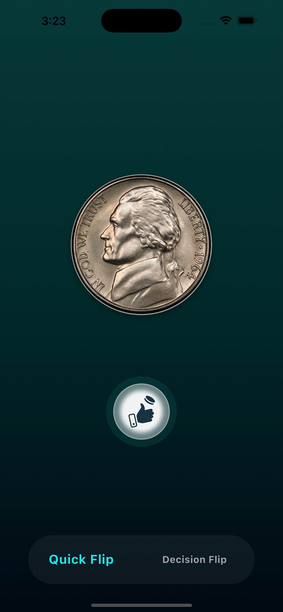
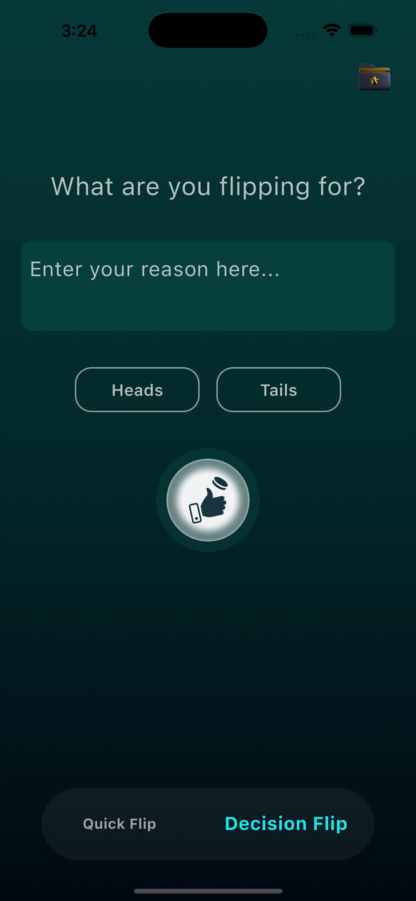
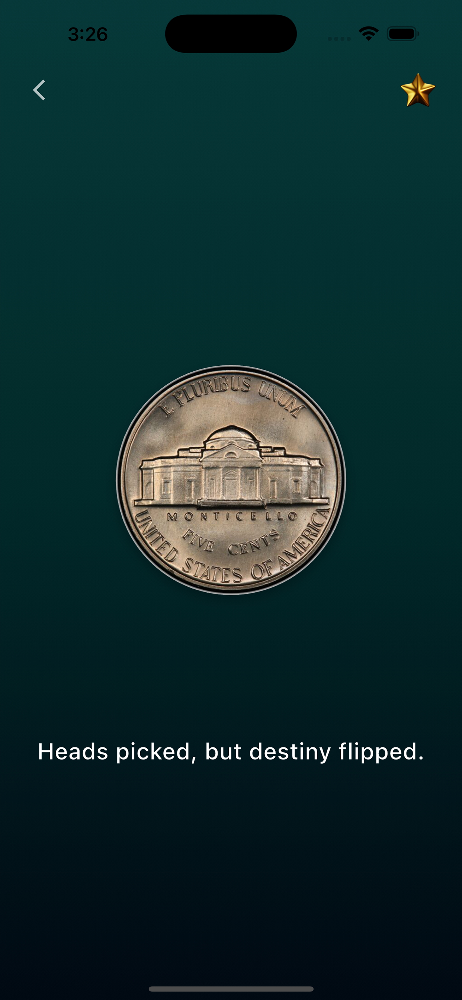

# Flip A Coin: Lucky Coin

A fun, elegant, and realistic coin-flipping app to help you make quick decisions or just play with chance. Whether you want to settle a bet or leave your fate to randomness, this app has you covered.

🎯 [Download on the App Store](https://apps.apple.com/us/app/flip-a-coin-lucky-coin/id6747534846?platform=iphone)  
📽️ [Watch the demo on YouTube](https://youtube.com/shorts/U45CLmqQzQY)

---

## ✨ Features

- 🪙 Realistic coin flip animation
- 🎵 Sound effects for flipping and result
- 📜 Save flip history with reason and result
- 🧠 Decide by luck with a clean and smooth UI


---

## 📱 Screenshots

| Quick Flip | Decision Flip | Add Reason|
|-----------|--------|---------------|
|  |  |  |

| Result | History |
|----------|------------|
|  |  |

---

## 🛠️ Built With

- **Flutter** – cross-platform UI framework
- **Hive** – lightweight local database
- **BLoC** – state management
- **audioplayers** – play sound effects
- **responsive_sizer** – responsive layout for all devices

---

## 🚀 Getting Started

To run this app locally:

```bash
git clone [https://github.com/tientruong13/Lucky-Coin.git]
cd flip-a-coin
flutter pub get
flutter run
